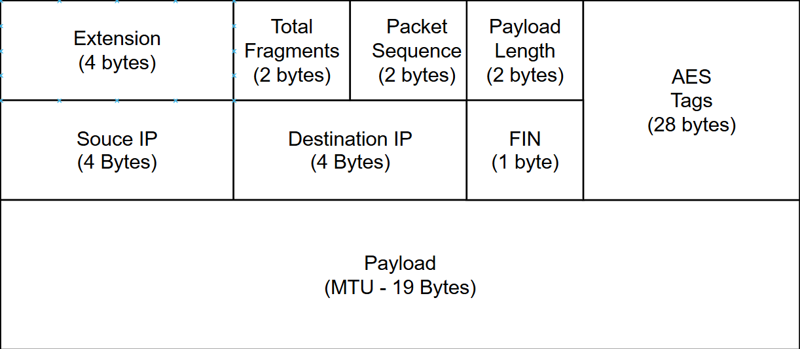

***

# Secure UDP File Transfer with Diffie-Hellman & AES-GCM

This project is a C++ client-server application designed for the secure and efficient transfer of files over a network. It implements a hybrid TCP/UDP protocol that leverages the strengths of both: TCP for a reliable, secure key exchange and UDP for high-speed, low-overhead data transmission.

The core of the system is built on strong cryptographic principles to ensure that data remains confidential and unaltered during transit.

### Key Features

*   **Secure Key Exchange**: Establishes a shared secret between the client and server using the Diffie-Hellman (DH) algorithm over a reliable TCP connection. This ensures that the session key itself is never transmitted directly.
*   **Robust Encryption**: File data is encrypted using **AES-256-GCM**, an Authenticated Encryption with Associated Data (AEAD) cipher. This provides both strong confidentiality and integrity, protecting against eavesdropping and data tampering.
*   **High-Speed UDP Transfer**: The actual file content is fragmented and sent using UDP to maximize throughput and reduce the latency associated with connection-oriented protocols.
*   **Concurrent Multi-Client Architecture**: The server is multi-threaded and uses a map-based structure to handle multiple clients at the same time. It constantly receives packets, processes their headers, and places each fragment in the correct buffer for the corresponding client, allowing for simultaneous, segregated file transfers.
*   **Custom Fragmentation Protocol**: A custom packet structure is used to handle file fragmentation and reassembly. The header includes a sequence number, total fragment count, and a `FIN` flag to manage out-of-order delivery and signal the end of a transmission.

*   **Configurable MTU**: The client uses a custom **Maximum Transmission Unit (MTU)** set to 1200 bytes to intelligently fragment files. This optimizes for network conditions by creating packets that avoid IP-level fragmentation, which can improve reliability.
*   **Industry-Standard Libraries**: Built using **OpenSSL** for cryptographic functions and the **GNU Multiple Precision Arithmetic Library (GMP)** to handle the large-number calculations required by the Diffie-Hellman exchange.

### How It Works

The transfer process is divided into two main phases:

1.  **Phase 1: Registration and Key Exchange (via TCP)**
    *   The client initiates a TCP connection to the server's registration port, which defaults to **8081**.
    *   A dedicated thread on the server handles the client's connection.
    *   The client and server perform a Diffie-Hellman key exchange to generate a unique session key. The shared secret from DH is processed through a SHA-256 Key Derivation Function (KDF) to create a cryptographically secure 256-bit AES key.
    *   The server stores this session key in a global map, keyed by the client's unique IP address and port. The TCP connection is then closed.

2.  **Phase 2: Encrypted File Transfer (via UDP)**
    *   The client reads the source file, splitting it into smaller fragments sized appropriately for the network MTU.
    *   Each fragment is encrypted using the established session key (AES-256-GCM) and wrapped in a custom UDP packet.
    *   The server's main thread continuously listens for UDP packets on its data port (default **8080**).
    *   When a packet arrives, the server reads the header and uses the sender's IP and port to look up the correct session key and fragment buffer in its map.
    *   It decrypts the payload and places the fragment into its appropriate place based on the sequence number. Once all fragments for a client are received (indicated by the `FIN` flag), the server reassembles the file.

### Getting Started

**Prerequisites:**
*   A C++ compiler (g++)
*   OpenSSL development libraries (`libssl-dev`)
*   GMP development libraries (`libgmp-dev`)

**Compilation:**

```bash
# Compile the server
g++ server_linuxv7.cpp -o server -lssl -lcrypto -lgmpxx -lgmp -pthread

# Compile the client
g++ client_linuxv7.cpp -o client -lssl -lcrypto -lgmpxx -lgmp
```

**Firewall Configuration (Linux using `ufw`):**
Before running the server, you may need to allow traffic on the necessary ports.

```bash
# Check firewall status
sudo ufw status

# Allow the default ports
sudo ufw allow 8080/tcp
sudo ufw allow 8080/udp
sudo ufw allow 8081/tcp

# Reload firewall to apply changes
sudo ufw reload
```

**Usage:**

1.  **Run the server:**
    The server listens on UDP port `8080` for data and TCP port `8081` for registration. These default values can be changed by modifying the `PORT` and `TCP_PORT` macros in `server_linuxv6.cpp`.
    ```bash
    ./server
    ```

2.  **Run the client:**
    The client connects to the server's IP address, specifies the UDP data port, and provides the path to the file to be sent.
    ```bash
    ./client <server_ip> <server_udp_port> <path_to_your_file>
    ```
    For example, to connect to a server on the same machine using the default port:
    ```bash
    ./client 127.0.0.1 8080 document.pdf
    ```

***

